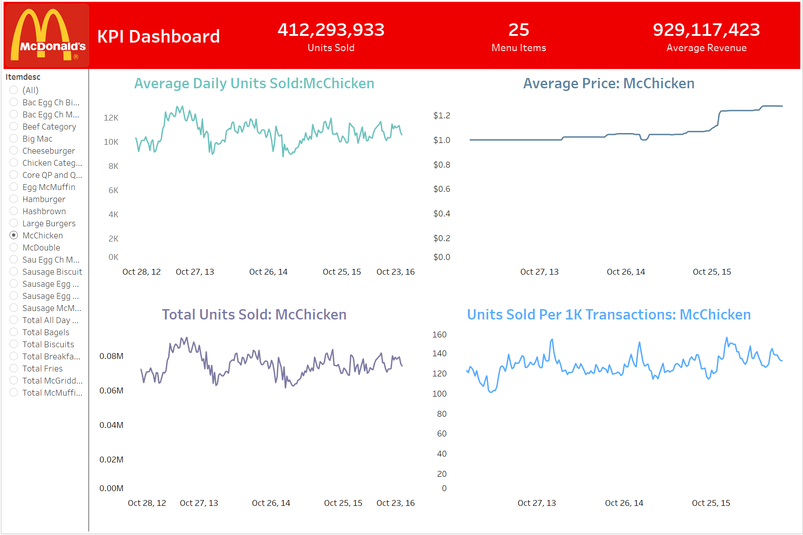

# McDonald's All-Day Breakfast Analysis

This project evaluates the impact of McDonald's "All Day Breakfast" strategy, implemented to boost profits and customer retention. The analysis focuses on quantifying the monetary and operational effects of this strategy and determining whether it is worth continuing. This repository contains the exploratory data analysis (EDA), hypothesis testing, and visualizations used to address the business problem.

## Business Problem

McDonald’s introduced “All Day Breakfast” to attract customers who prefer breakfast items beyond standard breakfast hours. The strategy faced mixed results:
- Sales increased in some regions but stagnated in others.
- Operational challenges due to differing processes for breakfast items.
- Low profit margins on breakfast items raised concerns about overall profitability.

The objective is to assess the policy's impact and determine whether it should be continued.

## Key Variables

The analysis focuses on:
- **`itemdesc`**: Item name to distinguish between breakfast and non-breakfast items.
- **`wk_ending`**: Weekly data timestamp.
- **`urws`**: Total units sold of an item over a week.
- **`wavg_price`**: Weighted average price of an item over the week.
- **`agc`**: Weekly customer count.

## Data Quality Concerns

1. **Missing Data**: 
   - `M395_weekly_sales.csv` contains 4,762 missing values.
   - `M395_rest_facts.csv` has 2 missing values.
2. **Data Entry Errors**:
   - Discrepancy between `urws` and `adus` values (8546 rows).
   - Inconsistent ZIP code formats.

## Hypotheses

1. **Sales Increase**: All-day breakfast boosts weekly sales of breakfast and non-breakfast items.
2. **Customer Count**: Introduction increases weekly customer count on average.
3. **Profitability**: Sales increase does not necessarily translate to revenue gains due to low breakfast margins.

## Insights

- **Sales**: Promoted breakfast items saw a temporary sales boost. However, non-breakfast item sales showed mixed results, indicating possible cannibalization.
- **Customer Count**: No strong evidence of increased customer count; seasonal patterns dominate.
- **Operational Challenges**: Kitchen clutter and implementation complexity varied by location.

## Methodological Notes

- Outlier analysis at the restaurant level was crucial to avoid skewing results.
- Regional factors and seasonal trends significantly influenced customer behavior.
- The exact promotion period and its context are critical for precise evaluation.

## Conclusion

This analysis concludes that the "All Day Breakfast" initiative showed mixed outcomes, necessitating further refinement in its implementation strategy. Key takeaways:
- Focus on regions with positive responses to maximize impact.
- Address operational inefficiencies to improve feasibility.
- Consider profit margin implications before scaling.
